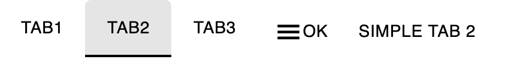

# JRG-Material Tabs

    

## Introduction

These are simple tabs similar to the design provided by material design. There are 3 main types of tabs...

### Getting Started

First see the [getting started](../../../../README.md#gettingStarted) steps for the framework as a whole

First install the dependency

    npm install --save @jrg-material/tabs

### Tabs

The Tabs element is the container for all tabs. Tab types and be mixed. Declaring it is easy...

    <jrg-tabs>
        <jrg-tab slot="jrg-tabs-item" name="tab1">
            <jrg-icon slot="jrg-tab-content" icon="menu"></jrg-icon>
            
Ok
 
        </jrg-tab>
        <jrg-text-tab slot="jrg-tabs-item" name="tab2" text="Tab Text"></jrg-text-tab>
        <jrg-icon-tab slot="jrg-tabs-item" name="tab2" icon="build"></jrg-icon-tab>
    </jrg-tabs>

### Icon Tab

These tabs are designed to hold a single icon. To declare an icon tab

